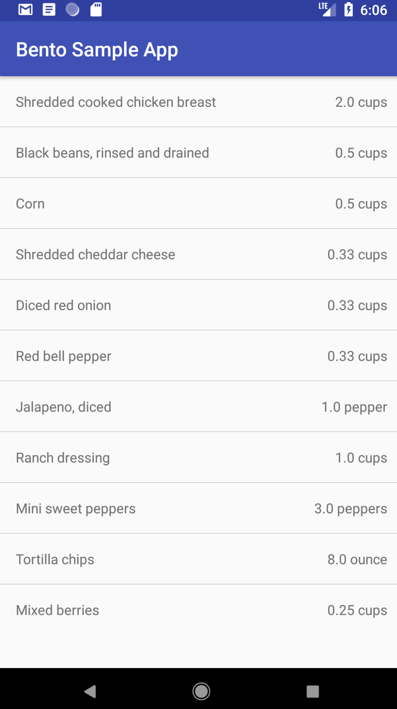

# An Example List Component

The `ListComponent` can be used to create a component that contains multiple repeating items that use the same `ComponentViewHolder` and the same type of data to populate the view. A good example of this might be a list of ingredients with the name on the right and the quantity on the right.

Let's start with our layout file (we won't be winning any design awards with this one). It's a simple `ConstraintLayout` with two `TextViews` that will be show side by side called `ingredient_list_item`.

```xml
<?xml version="1.0" encoding="utf-8"?>
<androidx.constraintlayout.widget.ConstraintLayout
    xmlns:android="http://schemas.android.com/apk/res/android"
    xmlns:app="http://schemas.android.com/apk/res-auto"
    xmlns:tools="http://schemas.android.com/tools"
    android:orientation="vertical"
    android:layout_width="match_parent"
    android:layout_height="wrap_content"
    android:padding="16dp">

    <TextView
        android:id="@+id/ingredient_name"
        android:layout_width="0dp"
        android:layout_height="wrap_content"
        tools:text="Corn"
        app:layout_constraintLeft_toLeftOf="parent"
        app:layout_constraintRight_toLeftOf="@+id/ingredient_quantity"
        app:layout_constraintTop_toTopOf="parent" />

    <TextView
        android:id="@+id/ingredient_quantity"
        android:layout_width="wrap_content"
        android:layout_height="wrap_content"
        android:textAlignment="textEnd"
        tools:text="1.5 cups"
        app:layout_constraintRight_toRightOf="parent"
        app:layout_constraintLeft_toRightOf="@+id/ingredient_name"
        app:layout_constraintTop_toTopOf="parent" />

</androidx.constraintlayout.widget.ConstraintLayout>
```

Now let's create a data class to go with that:

```kotlin
data class Ingredient(
    val name: String,
    var quantity: Double,
    val unit: String
)
```

And now lets create a viewholder that can bind this data to the layout:

```kotlin
class IngredientViewHolder: ComponentViewHolder<Nothing?, Ingredient>() {

    private lateinit var name: TextView
    private lateinit var quantity: TextView

    override fun inflate(parent: ViewGroup) =
            parent.inflate<ConstraintLayout>(R.layout.ingredient_list_item).apply {
                name = findViewById(R.id.ingredient_name)
                quantity = findViewById(R.id.ingredient_quantity)
            }

    override fun bind(presenter: Nothing?, element: Ingredient) {
        name.text = element.name
        quantity.text = "${element.quantity} ${element.unit}"
    }
}
```

Now we have a layout, data that matches the layout and a `ComponentViewHolder` to bind it all together. A recipe is made up of a lot of ingredients, and each ingredient in our app is going to look roughly the same so while you could create a recipe by making each `Ingredient` in the recipe a separate component, it's much easier to use a `ListComponent`. There are a few ways we can do this:

1. If we want to manage the items in the list outside in the same scope that the component was created, we can use the `ListComponent` constructor:

```kotlin
val ingredients = listOf(
    Ingredient("Shredded cooked chicken breast", 2.0, "cups"),
    Ingredient("Black beans, rinsed and drained", 0.5, "cups")
)
val recipeComponent = ListComponent<Nothing?, Ingredient>(null, IngredientViewHolder::class.java)
recipeComponent.setData(ingredients)
```

From there we can `removeData` and `appendData` on the `recipeComponent` to add or remove new ingredients. This is usually a good option for very simple list components or if you're not planning on modifying the underlying data very often.

2. We can also extend the `ListComponent` class to create our own `RecipeComponent` that can manage its own list of `Ingredient`s.

```kotlin
class RecipeComponent(
    private val ingredients: List<Ingredient>
): ListComponent<Nothing?, Ingredient>(null, IngredientViewHolder::class.java) {

    init { setData(ingredients) }

    fun doubleIt() {
        ingredients.forEach { it.quantity *= 2 }
        notifyDataChanged()
    }
}
```

Here we can add handy methods like `doubleIt` that increases the quantity of each ingredient for when you're just so hangry you need twice as much food.

Here's what it looks like in an activity with a recipe for a Southwest Chicken Salad Bento Box:

```kotlin
class ExampleActivity: AppCompatActivity() {

    private val componentController by lazy {
        RecyclerViewComponentController(recyclerView)
    }

    override fun onCreate(savedInstanceState: Bundle?) {
        super.onCreate(savedInstanceState)
        setContentView(R.layout.activity_recycler_view)

        componentController.addComponent(RecipeComponent(listOf(
                Ingredient("Shredded cooked chicken breast", 2.0, "cups"),
                Ingredient("Black beans, rinsed and drained", 0.5, "cups"),
                Ingredient("Corn", 0.5, "cups"),
                Ingredient("Shredded cheddar cheese", 0.33, "cups"),
                Ingredient("Diced red onion", 0.33, "cups"),
                Ingredient("Red bell pepper", 0.33, "cups"),
                Ingredient("Jalapeno, diced", 1.0, "pepper"),
                Ingredient("Ranch dressing", 1.0, "cups"),
                Ingredient("Mini sweet peppers", 3.0, "peppers"),
                Ingredient("Tortilla chips", 8.0, "ounce"),
                Ingredient("Mixed berries", 0.25, "cups")
        )))
    }
}
```



You might notice that by default the `ListComponent` will also add a divider view between each list item. You can always toggle it off with `toggleDivider(false)` or use your own divider layout file if you need with `setDividerViewHolder(...)`.
