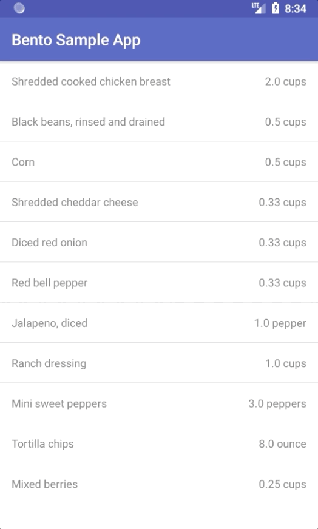

# User Interaction in Bento Components

Using the example of a recipe list in the [List Component Example](./ListComponentExample.md), we can add a `Presenter` to handle a click action on our ingredients. Say that the user wants to cross out an ingredient after using it in the recipe. Let's look again at our `RecipeComponent`:

```kotlin
class RecipeComponent(
    private val ingredients: List<Ingredient>
): ListComponent<Nothing?, Ingredient>(null, IngredientViewHolder::class.java) {

    init { setData(ingredients) }

    fun doubleIt() {
        ingredients.forEach { it.quantity *= 2 }
        notifyDataChanged()
    }
}
```

There was no need for a `Presenter` before since we had no interactions or complex logic. Now though we can add our own. We want to do something when the ingredient is clicked, so let's create a `Presenter` interface to represent that:

```kotlin
interface IngredientPresenter {
    fun onIngredientClicked(ingredient: Ingredient)
}
```

When an ingredient is clicked, we want to change its underlying state, so we can add another parameter to the `Ingredient` data class to track that:

```kotlin
data class Ingredient(
    val name: String,
    var quantity: Double,
    val unit: String,
    var isChecked: Boolean = false
)
```

Now to make things easier, we can implement our `IngredientPresenter` interface in our component and specify the presenter type in the call the the super `ListComponent` constructor. Since we don't have a reference to the `RecipeComponent` in its own constructor to pass into the `ListComponent` we can pass in `null` and then override the `getPresenter` method to return the presenter we want.

```kotlin
class RecipeComponent(
    private val ingredients: List<Ingredient>
): IngredientPresenter,
        ListComponent<IngredientPresenter, Ingredient>(null, IngredientViewHolder::class.java) {

    init { setData(ingredients) }

    override fun getPresenter(position: Int) = this

    override fun onIngredientClicked(ingredient: Ingredient) {
        ingredient.isChecked = !ingredient.isChecked
        notifyDataChanged()
    }

    fun doubleIt() {
        ingredients.forEach { it.quantity *= 2 }
        notifyDataChanged()
    }
}
```

Now let's update the `IngredientViewHolder` to bind click actions to the presenter:

```kotlin
class IngredientViewHolder: ComponentViewHolder<IngredientPresenter, Ingredient>() {

    // Used for click handling.
    private lateinit var presenter: IngredientPresenter
    private lateinit var ingredient: Ingredient

    private lateinit var name: TextView
    private lateinit var quantity: TextView

    override fun inflate(parent: ViewGroup) =
            parent.inflate<ConstraintLayout>(R.layout.ingredient_list_item).apply {
                name = findViewById(R.id.ingredient_name)
                quantity = findViewById(R.id.ingredient_quantity)

                // Creating the click listener once on inflation.
                setOnClickListener {
                    presenter.onIngredientClicked(ingredient)
                }
            }

    override fun bind(presenter: IngredientPresenter, element: Ingredient) {
        this.presenter = presenter
        this.ingredient = element

        name.text = element.name
        quantity.text = "${element.quantity} ${element.unit}"

        listOf(name, quantity).forEach {
            it.paintFlags = if (element.isChecked) {
                // Strikethrough.
                it.paintFlags or Paint.STRIKE_THRU_TEXT_FLAG
            } else {
                // No Strikethrough.
                it.paintFlags and Paint.STRIKE_THRU_TEXT_FLAG.inv()
            }
        }
    }
}
```

In the inflate method we now create and apply a click listener to the ingredient layout. Since `inflate` is always called before `bind`, we can use the `presenter` and `ingredient` lateinit variables without fear that they will not be initialized. We're creating the click listener in the `inflate` method instead of `bind` since we know that the `inflate` method will only be called once, while `bind` may be called multiple times and we don't want to recreate the click listener each time it's called.

In the bind method we now assign the `presenter` and `ingredient` variables values. This makes them available for the click listener that we bound in the `inflate` method. We also add a strikethrough on our views if the ingredient element `isChecked`. Let's see what it looks like in action:


